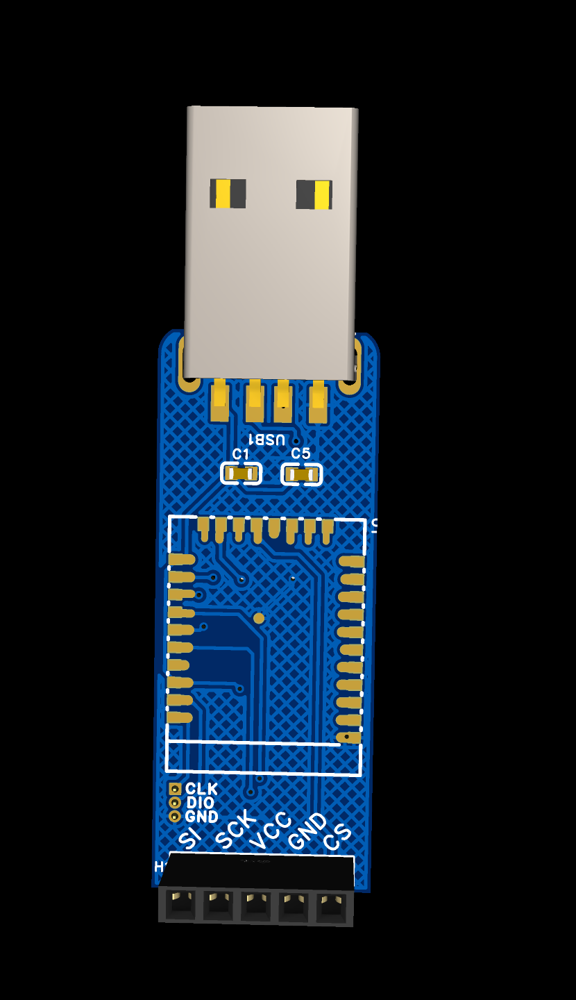

# ZMK 接收器

[中文](README.md)
[English](README_en.md)

---

> 使用睫毛哥的micro52840做的一个接收器
> 
> **淘宝**: [Micro nrf52840](http://e.tb.cn/h.gurVKZZWPhSRJPc?tk=apWz3k02DW5HU7632)
> 
> **Aliexpress** : [Micro nrf52840](https://www.aliexpress.com/item/1005008478700957.html)

**所有都接收器需要自行刷bootloader**, bootloader文件在bootloader文件夹下面，PCB文件夹中的文件用嘉立创的EDA软件打开。case文件夹里面是壳子，可以自己打印

## 单接收器

这个接收器是没有带显示器的，按自己需要使用吧。

| 元件      | 值              | 数量 | 封装                            |
| ----------- | ----------------- | ------ | --------------------------------- |
| 蓝色LED   | -               | 1    | 0805                            |
| 电阻      | 1.5k            | 1    | 1206                            |
| 电容      | 100nf           | 2    | 1206                            |
| reset按钮 | BX-TS-26-4417TT | 1    | SW-SMD_4P-L5.2-W5.2-P3.70-LS6.5 |
| USB       | USB-A           | 1    | USB-A-SMD_U217-041N-4BV81       |
| 主控      | -               | 1    | 睫毛哥的micro 52840             |

## Nice!view 接收器

这个接收器外露了nice!view的针脚，可以直接焊接nice!view，也可以焊接轨迹球等spi通信的外围设备

| 元件      | 值              | 数量 | 封装                            |
| ----------- | ----------------- | ------ | --------------------------------- |
| 蓝色LED   | -               | 1    | 0805                            |
| 电阻      | 1.5k            | 1    | 1206                            |
| 电容      | 100nf           | 2    | 1206                            |
| reset按钮 | BX-TS-26-4417TT | 1    | SW-SMD_4P-L5.2-W5.2-P3.70-LS6.5 |
| USB       | USB-A           | 1    | USB-A-SMD_U217-041N-4BV81       |
| 主控      | -               | 1    | 睫毛哥的micro 52840             |
| nice!view  | -               | 1    | nice!view          |

]
